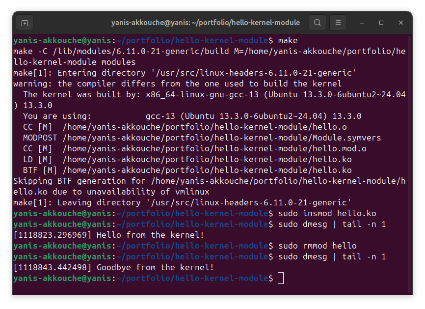

# Hello Kernel Module 🐧

A simple Linux kernel module that logs a message when inserted and removed.

## 🧠 What it does

- Logs "Hello from the kernel!" when inserted (`insmod`)
- Logs "Goodbye from the kernel!" when removed (`rmmod`)

## 🛠️ How to use

```bash
make
sudo insmod hello.ko
dmesg | tail

sudo rmmod hello
dmesg | tail
```
## 📸 Demo


